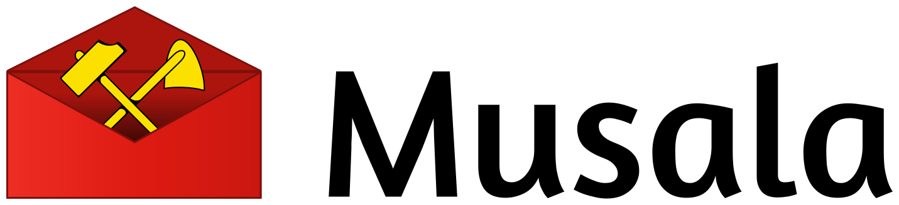

:rotating_light: **The project has moved to a self-hosted git instance!**<br/>
:rotating_light: **Please use the new URL for an up-to-date version:** https://code.apps.glenux.net/glenux/musala

# 


[](https://github.com/glenux/musala/blob/master/LICENSE.txt)
[](https://patreon.com/glenux)

Every morning, get the content of your favorite kanban board by email, WhatsApp or SMS.

Note: _musala_ means _work, occupation_ [in Lingala](https://dic.lingala.be/fr/mosala)

## Roadmap

Task sources:

* :heavy_check_mark: __Trello__
* :x: Nextcloud Deck (not yet) - [API Reference](https://github.com/nextcloud/deck/blob/master/docs/API.md)
* :x: Wekan (not yet) - [API Reference](https://github.com/wekan/wekan/wiki/REST-API)
* :x: Libreboard (not yet)
* :x: Github Projects (not yet)

Source selection

* :heavy_check_mark: __All of them__
* :heavy_check_mark: __Favorited boards__
* :heavy_check_mark: __Only selected ones__

Delivery via:

* :heavy_check_mark: __E-mail__
* :x: Telegram
* :x: Slack
* :x: SMS
* :x: Whatsapp
* :x: IRC

User interface for account configuration

* :heavy_check_mark: Command line + environment variables
* :x: Web app

## Installation

### With go

Make sure you have Go installed, then type:

    $ go install github.com/glenux/musala/...

It will install Musala Mail binary in `$GOPATH/bin`


### With docker

Make sure you have Docker installed, then type:

    $ docker build -t musala -f docker/Dockerfile .

## Usage

### Creating a developper account

1. Create a Trello account on <https://trello.com>
2. Check your mailbox and confirm your email
3. Enable developper account on <https://trello.com/app-key>
4. Get an developer API KEY


### Getting a Trello TOKEN

Open the following URL in your web browser and authenticate yourself. That will
give you the TRELLO_TOKEN that will be needed in the next step.

<https://trello.com/1/authorize?expiration=never&scope=read,write,account&response_type=token&name=Musala%20Mail&key=YOUR-API-KEY>


### Using the binary

Prepare your environment with the following variables

```
EMAIL_FROM:    no-reply@example.com
EMAIL_TO:      me@example.com
EMAIL_SUBJECT: "Daily mail for YYYYYY"
TRELLO_URL:    https://trello.com/b/xxxxx/yyyy
TRELLO_TOKEN:  xxxxxxxxxxxxxx
SMTP_HOSTNAME: smtp.example.com
SMTP_USERNAME: foobar@example.com
SMTP_PASSWORD: securefoobar
SMTP_PORT:   587
# SMTP_AUTH_TYPE accepts either "none", "plain" or "login"
SMTP_AUTH_TYPE: plain 
# SMTP_SECURITY_TYPE accepts either "none", "tls" or "starttls"
SMTP_SECURITY_TYPE: tls
```

Then run the program:

    $ $GOPATH/bin/musala

### Using with docker

    $ docker build -f docker/Dockerfile -t musala .
    $ docker run  \
        -e EMAIL_FROM=
        -e EMAIL_TO=
        -e EMAIL_SUBJECT=
        -e EMAIL_FROM=
        -e EMAIL_TO=
        -e EMAIL_SUBJECT=
        -v /var/lib/musala/musala.cron:/app/musala.cron \
        -it musala:latest

## Contributing

1. Fork it ( http://github.com/glenux/musala/fork )
2. Create your feature branch (`git checkout -b my-new-feature`)
3. Commit your changes (`git commit -am 'Add some feature'`)
4. Push to the branch (`git push origin my-new-feature`)
5. Create new Pull Request


## Credits

* [Glenn Y. ROLLAND](https://github.com/glenux) - author & maintainer: 
* You? Fork the project and become a contributor!

Got questions? Need help? Tweet at [@glenux](https://twitter.com/glenux)


## License

Musala is Copyright © 2018-2021 Glenn ROLLAND. It is free software, and may be redistributed under the terms specified in the LICENSE.txt file.

## See also...

Following projects may also inspire you:

* [72nd/deck-cli](https://github.com/72nd/deck-cli): a command-line tool for interacting with Nextcloud's Deck Plugin by using it's API

