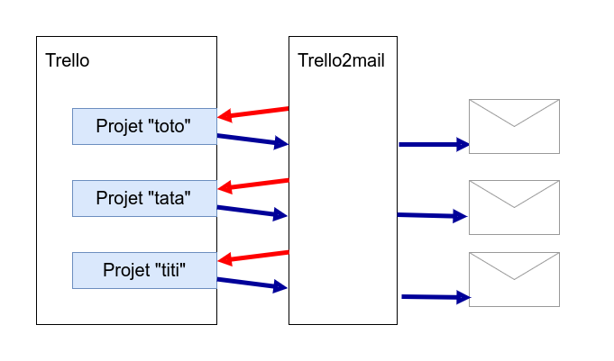

# Projet Musala Mail

### Rappel par email des taches à faire

----

## Vue d'ensemble 

1. contexte = le probleme initial
2. vision = ce qu'on va faire / ce qu'on a fait
3. mission = comment on l'a fait
   - organisation
   - les infos techniques
   - etc.

----

## Le contexte

- Outil trello
- 25-30 board pour des projets différents
- 1 ou 2 projets sont consultés seulement !

:arrow_right: **Les autres taches passent à la trappe !**

----

## Vision

Recevoir un résumé, prioritisé, dans ma boite email, tous les jours

----

## Mission

Fabriquer un outil qui :

- se connecte sur trello
- récupere la liste des boards
- récupere les taches sur chaque board
- trie les taches
- envoie un email résumant le board

:arrow_right: tous les jours à 7h45 :wink:

----

## Enjeux techniques

(Les difficultés qu'on va rencontrer sur le chemin)

* comment on se connecte à Trello ?
* comment on envoie un email ?

----

## Gestion du projet

Le projet s'est déroulé selon les étapes suivantes, afin de minimiser le risque d'échec / de blocage :

1. tester la faisabilité de l'envoi d'emails
2. tester la faisabilité de l'accès à Trello (API? scrapping?)
3. cabler/coder le reste des étapes

:arrow_right: L'ensemble de ces étapes a été suivi sur un board Trello, et le code source a été versionné avec Git, sur github (annexe 25)

----

## Architecture du projet 

:arrow_right: T2M se connecte sur Trello, récupere les données et les envoie directement par email. Il n'y a pas de base de données !

----

## Choix techniques

### Langage de programmation

Musala Mail est développé en Go ( https://golang.org ) 

Ce langage permet :

- un développement rapide
- une blablabla

----

## Choix techniques

### Framework

Musala Mail utilise le framework blablablala

-----

### API Trello

Musala Mail utilise la bibliotheque blabla pour se connecter à l'api trello.

L'autre bibliotheque était trop pourrie (apres avoir fait des essais pendant 2 jours).

----

### Envoi d'emails

bblabla

